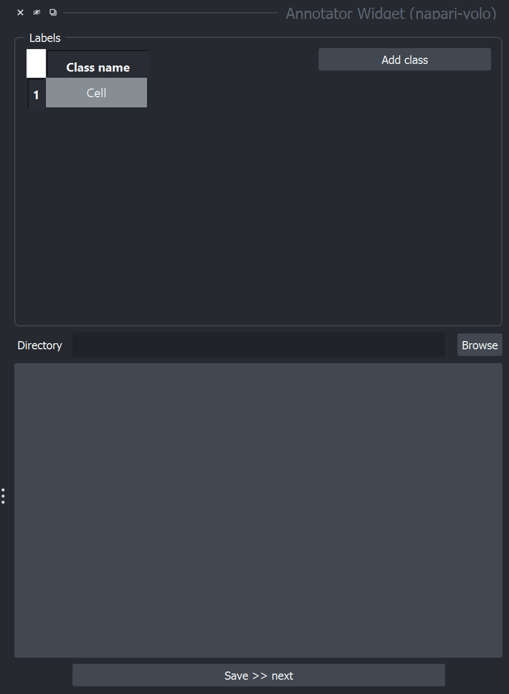
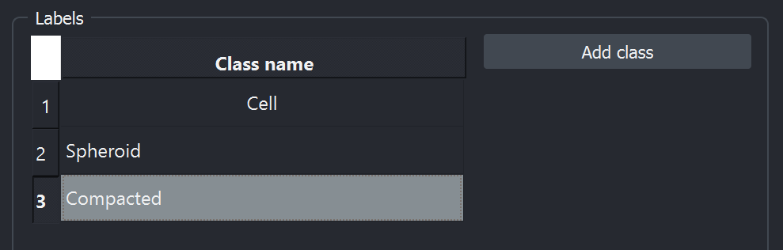
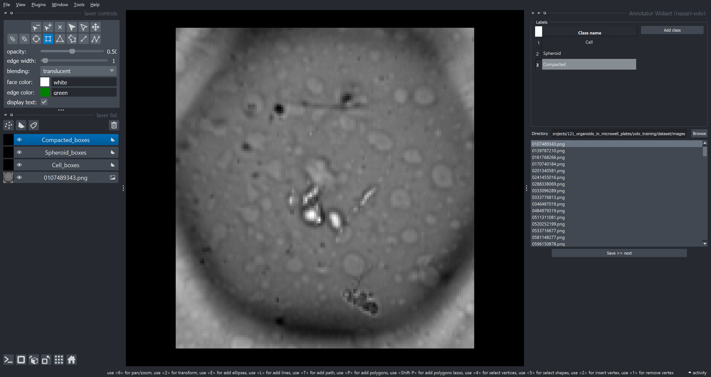
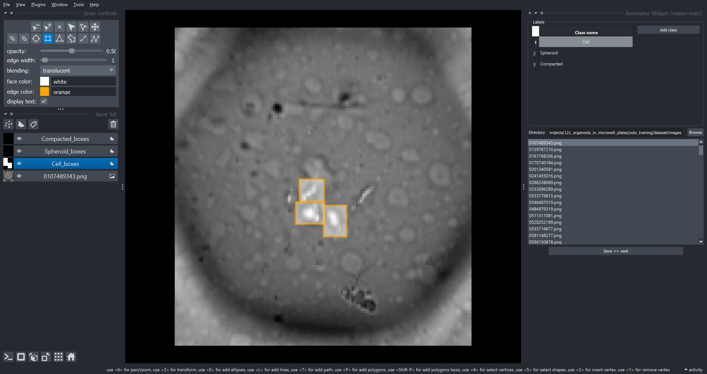

# napari-yolo

Bridge between napari and Yolo

----------------------------------

This [napari] plugin was generated with [Cookiecutter] using [@napari]'s [cookiecutter-napari-plugin] template.

<!--
Don't miss the full getting started guide to set up your new package:
https://github.com/napari/cookiecutter-napari-plugin#getting-started

and review the napari docs for plugin developers:
https://napari.org/stable/plugins/index.html
-->

## Usage

To use, the plugin, open then `AnnotatorWidget` from the napari Plugins menu (`Plugins > Annotator Widget (napari-yolo)`). Before you start annotating, define the classes in your dataset by adding as many classes as you want with the `Add class` button. You can give a specific name to each of the classes you want to draw.

The result could look like this:

Once that is done, load the images in your training set into the annotation widget by selecting the directory with the images using the `Browse` button. The images will be loaded into the widget and you can start annotating them. Selecting an image in the list will directly load it into the viewer and create as many shapes layers as you created classes in the above step.

The rectangle tool is auto-selected. To select the class you want to annotate, you can either click on the correct Shapes layer in the layer list on the left or select the class in the annotation widget on the top right. Once you are done with drawing the bounding boxes, you should look at something like this:

If you are happy with your annotation, click on the `Save >> next` button on the bottom of the widget. This will load the next image into the viewer and you can start annotating. Annotated images will be marked as green in the list widget.

## Installation

You can install `napari-yolo` via [pip]:

    pip install napari-yolo

To install latest development version :

    pip install git+https://github.com/jo-mueller/napari-yolo.git

## Contributing

Contributions are very welcome. Tests can be run with [tox], please ensure
the coverage at least stays the same before you submit a pull request.

## License

Distributed under the terms of the [BSD-3] license,
"napari-yolo" is free and open source software

## Issues

If you encounter any problems, please [file an issue] along with a detailed description.

[napari]: https://github.com/napari/napari
[Cookiecutter]: https://github.com/audreyr/cookiecutter
[@napari]: https://github.com/napari
[MIT]: http://opensource.org/licenses/MIT
[BSD-3]: http://opensource.org/licenses/BSD-3-Clause
[GNU GPL v3.0]: http://www.gnu.org/licenses/gpl-3.0.txt
[GNU LGPL v3.0]: http://www.gnu.org/licenses/lgpl-3.0.txt
[Apache Software License 2.0]: http://www.apache.org/licenses/LICENSE-2.0
[Mozilla Public License 2.0]: https://www.mozilla.org/media/MPL/2.0/index.txt
[cookiecutter-napari-plugin]: https://github.com/napari/cookiecutter-napari-plugin

[file an issue]: https://github.com/jo-mueller/napari-yolo/issues

[napari]: https://github.com/napari/napari
[tox]: https://tox.readthedocs.io/en/latest/
[pip]: https://pypi.org/project/pip/
[PyPI]: https://pypi.org/
